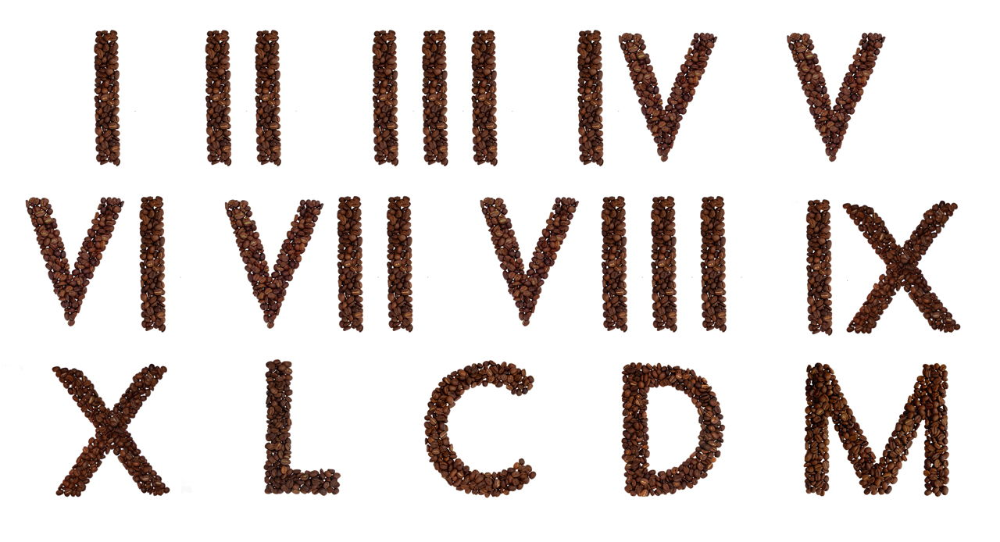

# RomanLiteralsKata
This project uses a coding cata from the FAU CS6 SWAT Seminar to set up code testing and automated testing 
with github actions.

The cata is also described [here](https://codingdojo.org/kata/RomanNumerals/)

